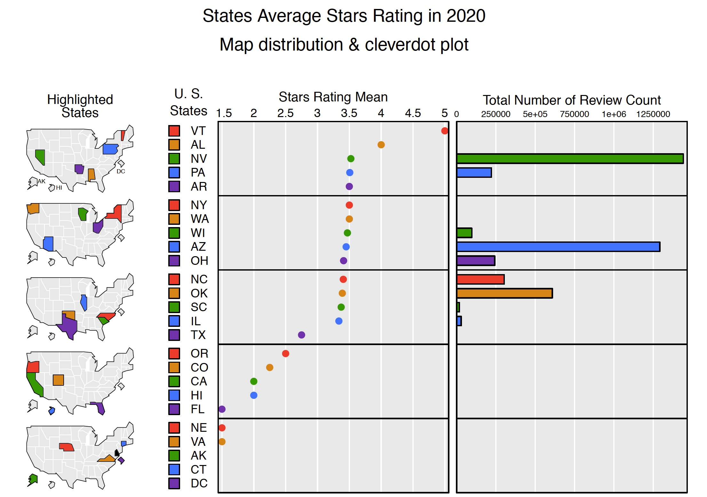
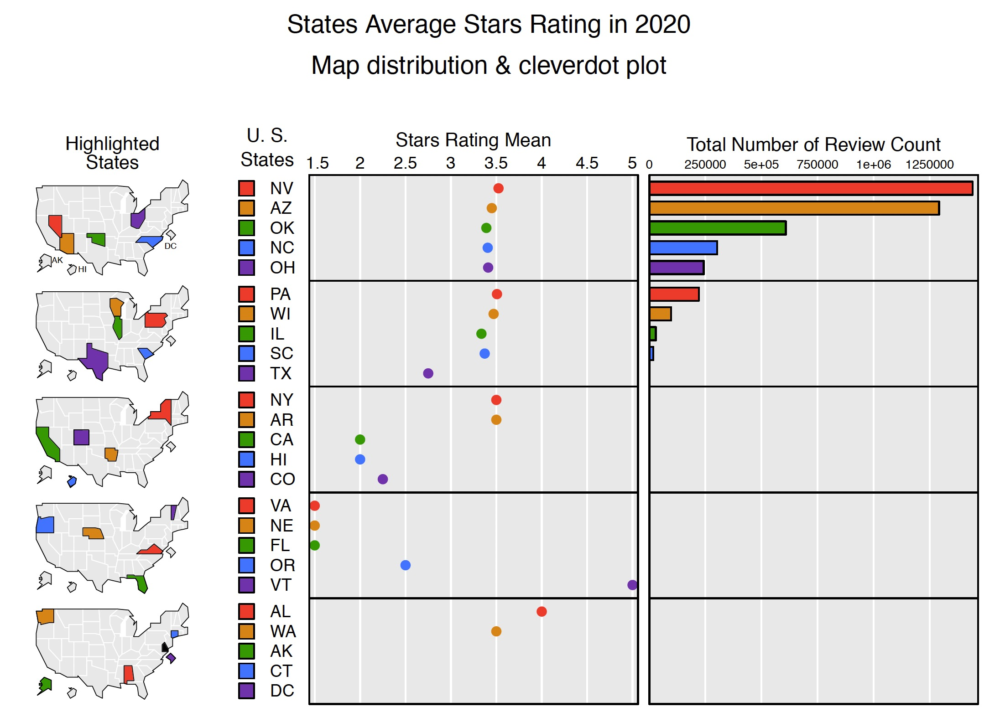

# Results-part(B)

## Yelp Rating Analysis ## 

```{r include=FALSE}
library(dplyr)
library(jsonlite)
library(stringr)
library(ggplot2)
library(tidyr)
#install.packages("micromapST")
library(micromapST)
library(ggpubr)
#install.packages("hrbrthemes")
library(hrbrthemes)
```

```{r include=FALSE}
yelp_clean_data <- read.csv("yelp_cleaned_data.csv")
```

#### Overview of Stars Rating graphical distribution

```{r include=FALSE}
yelp_micromap = yelp_clean_data[,c('state','stars',"review_count")]
datamean = group_by(yelp_micromap, state) %>% summarize_each(funs(mean))
countsum = group_by(yelp_micromap, state) %>% summarize_each(funs(sum))
```

```{r include=FALSE}
rating_mean <- read.csv("rating_mean.csv")
data(wflung00and95,wflung00and95US,wflung00cnty,envir=environment())
d = cbind(wflung00and95, rating_mean[3:4])
```

```{r include=FALSE}

#panelDesc01 <- data.frame(
#type=c("map","id","dot","bar"),
#lab1=c("","","Stars Rating Mean","Total Number of Review Count"),
#col1=c(NA,NA,13,14),
#panelData= c("","","","")
#)

#pdf(file="States_Average_Stars_Rating_in_2020(sort by ratings).pdf",width=7.5,height=10)

#micromapST(d, panelDesc01, sortVar=13,ascend = FALSE,
#title=c("States Average Stars Rating in 2020",
#"Map distribution & cleverdot plot")
#)

```

```{r include=FALSE}
#panelDesc01 <- data.frame(
#type=c("map","id","dot","bar"),
#lab1=c("","","Stars Rating Mean","Total Number of Review Count"),
#col1=c(NA,NA,13,14),
#panelData= c("","","","")
#)


#pdf(file="States_Average_Stars_Rating_in_2020 (Sort by review count).pdf",width=7.5,height=10)

#micromapST(d, panelDesc01, sortVar=14,ascend = FALSE,
#title=c("States Average Stars Rating in 2020",
#"Map distribution & cleverdot plot")
#)


```

In This section, we will mainly focusing on analyzing the distribution and characteristics of stars rating in Yelp data. The aim of this part is to answer several question: Is the rating distribution has geographical features? What is the distribution of Ratings among different Restaurant type? What is the distribution of Ratings among different country style? And what is the relationship between stars rating and the price level of this restaurant？  

First of all, we want to look deep into the Geographical distribution characteristics for yelp stars rating data, to study the relationship between state distribution and the restaurants’ stars rating.    




```
micromapST(d, panelDesc01, sortVar=13,ascend = FALSE,
title=c("States Average Stars Rating in 2020",
"Map distribution & cleverdot plot")
)
```
In this section, we use ```micromapST``` packages to analyze the yelp stars rating dataset. As for this packages, we can have a clear and straightforward idea about the state geographical spot and how it related to the attribute we are looking for. Due to the data size limitation, we have to consider the influence from too small data size for some states which can dramatically distort the relationship and results. Accordingly, we choose stars ratings, state, and review count as data input.   


In each of the above figures, we can see three columns: the left one is the the map of state in US which colored state means that this state is chosen, the second column is cleverdot plot for average stars ratings in each state, and the last column is about the total number of review counts in each state. The first figure is sorted by ratings, and the second one is sorted by counts.  

In the first picture, we can see that the average ratings of each state ranging from 1-5, mainly concentrated around 3.5 and it seems that there is some relation among states distribution. However, we have to take number of counts into consideration, so we switch the sorting method from ratings to ratings to total number. In the second picture, we can see that for total number of counts large enough stats (which can draw a more stable and more convicing idea), the stars rating is relatively constant around 3.5 with no obvious geographical features. So, we can come to the conclusion that the stars ratings in Yelp do not present obvious geographical features among states. And for deeper analysis in stars ratings, we choose sub-dataset in Arizona state as a representative, which has top2 capacity of total review counts.   


#### Stars Rating Analysis in Arizona

```{r include=FALSE}
yelp_az <- yelp_clean_data[yelp_clean_data$state == "AZ",]
```

```{r echo==FALSE}
ggplot(yelp_az, aes(x=stars)) + 
geom_bar(color = "black", fill="lightblue")+
xlab("Stars Ratings")+
ggtitle("Stars Ratings Distribution in State Arizona")+
geom_vline(aes(xintercept=mean(stars)),
            color="blue", linetype="dashed", size=1)
 
```

```
yelp_az <- yelp_clean_data[yelp_clean_data$state == "AZ",]
ggplot(yelp_az, aes(x=stars)) + geom_bar()
```
In This section, we will mainly focus on the sub-dataset in Arizona State to represent the total ratings, as we conclude that there is limited difference in stars ratings among different states.   

In the fist place, we draw a overview for stars distribution in Arizona State, we use ```ggplot```bar chart to display the distribution of this uncontinuous variable of stars rating, and we can see a left-skewed normal distribution and the dashed blue line is the mean for ratings. In the following part, we will look into the relationship of between ratings and Restaurant type and Country style. 


##### 1. The distribution of Ratings among different Restaurant category

```{r echo=FALSE}
newdata <- yelp_az[,c(1,2,10,11,42,43,44,45,46,48,50,56,55,57,58)]
yelp_az_tidy <- gather(data = newdata, key = "category", value = "value", 5:15)
yelp_az_tidy =  yelp_az_tidy[yelp_az_tidy$value==1,]
yelp_az_tidy = yelp_az_tidy[,-6]
```

```{r echo=FALSE}
ggplot(yelp_az_tidy, aes(stars))+
  geom_bar(color = "black", fill = "lightblue")+
  facet_wrap(~category)+
  ylab("Count for Restaurant")+
  xlab("Stars Rating Distrubution")+
  ggtitle("Bar chart of the stars ratings in Arizona (Facet by: categories)")
```
```{r echo=FALSE}
ggboxplot(yelp_az_tidy, 
          x = "category", 
          y = "stars",
          fill = "category",
          bxp.errorbar = T,
          palette= "GnBu",
          add = "point"
          ) +
labs(title = "Boxplot of the stars ratings in Arizona",
    subtitle = "Grouped by: Category",
    x = "Category for Restaurant",
    y = "Stars Rating"
    )+
  theme(axis.text.x = element_text(angle = 20, hjust = 1))

```
```
ggplot(yelp_az_tidy,aes(stars))+geom_bar()+facet_wrap(~category)
```
```
ggboxplot(yelp_az_tidy)
```
In this section, Let’s take a close look at the relationship between The distribution of Ratings and different Restaurant category. We use ```ggplot```bar chart and ```ggboxplot```as our visualization tools. The Restaurant category means the main business of this restaurant, which includes alcohol/brunch/drinks/meat/vegan etc.. The question is whether the rating distribution is constant or will be affected by different main business.  

In the first chart, we can see rating distribution bar chart grouped by different Restaurant category. The different average height in different plot is driven by the size of data. We can see that almost every Restaurant category shows a left-skewed normal distribution in ratings, which means people are more tending to give lower rating that higher rating centered around 3.5-4, and this is constant with the total distribution.  

In the second chart, we can see that rating distribution boxplot grouped by different Restaurant category. In this figure, we can see more quantitative for the difference among categories. It showes that dessert/drinks/organics often has higher average ratings compared to others, specially for organics(But organics has relatively low datasize and this will challenge the calidity of the results). And for meat, although has almost same average ratings with others, it has wider range of rating distribution and less-likely normal distribution, which can indicate that people may perform more diversified opions toword meat restaurant.  


##### 2. The distribution of Ratings among different Countries

```{r echo=FALSE}
country_data <- yelp_az[,c(2,10,40)]
country_data$american <- ifelse(str_detect(country_data$country,"american"),1,0)
country_data$mexican <- ifelse(str_detect(country_data$country,"mexican"),1,0)
country_data$italian <- ifelse(str_detect(country_data$country,"italian"),1,0)
country_data$chinese <- ifelse(str_detect(country_data$country,"chinese"),1,0)
country_data$japanese <- ifelse(str_detect(country_data$country,"japanese"),1,0)
country_data$middleeastern <- ifelse(str_detect(country_data$country,"middleeastern"),1,0)
country_data$french <- ifelse(str_detect(country_data$country,"french"),1,0)
country_data$korean <- ifelse(str_detect(country_data$country,"korean"),1,0)
country_data$spanish <- ifelse(str_detect(country_data$country,"spanish"),1,0)
country_data$thai <- ifelse(str_detect(country_data$country,"thai"),1,0)
country_data$greek <- ifelse(str_detect(country_data$country,"greek"),1,0)
country_data$canadian <- ifelse(str_detect(country_data$country,"canadian"),1,0)
country_data$vietnamese <- ifelse(str_detect(country_data$country,"vietnamese"),1,0)
```

```{r echo=FALSE}
country_tidy <- gather(data = country_data, key = "Country", value = "value", 4:16)
country_tidy = country_tidy[country_tidy$value==1,]
country_tidy <- na.omit(country_tidy)
country_tidy = country_tidy[,c(1,2,4)]
```

```{r echo=FALSE}
ggplot(country_tidy, aes(stars))+
  geom_bar(color = "black", fill = "lightblue")+
  facet_wrap(~Country)+
  ylab("Count for Restaurant")+
  xlab("Stars Rating Distrubution")+
  ggtitle("Bar chart of the stars ratings in Arizona (Facet by: Countries)")
```

```{r echo=FALSE}
ggboxplot(country_tidy, 
          x = "Country", 
          y = "stars",
          fill = "Country",
          bxp.errorbar = T,
          palette= "GnBu",
          add = "point"
          ) +
labs(title = "Boxplot of the stars ratings in Arizona",
    subtitle = "Grouped by: Country",
    x = "Country for Restaurant Style",
    y = "Stars Rating"
    )+
  theme(axis.text.x = element_text(angle = 20, hjust = 1))
```
```
country_data$american <- ifelse(str_detect(country_data$country,"american"),1,0)
country_tidy <- gather(data = country_data, key = "Country", value = "value", 4:16)
ggplot(yelp_az_tidy,aes(stars))+geom_bar()+facet_wrap(~category)
```
```
ggboxplot(yelp_az_tidy)
```
In this section, There is another special perspective we’d like to explore while analyzing the relationship between stars ratings and country styles. We use ```ggplot```bar chart and ```ggboxplot```as our visualization tools as well. The country style means the food style origin of these restaurant, which includes American/Mexican/Chinese/Japanese etc.(We choose top16 country for analysis). The question is whether the rating distribution is constant or will be affected by different country style.  

In the first chart, we can see rating distribution bar chart grouped by different country style. The different average height in different plot is driven by the size of data. We can see that almost every country style shows a left-skewed normal distribution in ratings. And we can also get the information that American and Mexican food has a predominated role in US compared to others.  

In the second chart, we can see that rating distribution boxplot grouped by different country style. In this figure, we can see more quantitative for the difference among countries. It shows that the stars rating distribution is relatively stable and constant among different country styles, and we can divide it into two parts: one part for first 4 country style (American/Mexican/Chinese/Italian), and another group for other country styles. The first groups has relatively higher datasize, lower average ratings and wider rating distribution. The second group often shows higher average ratings, narrower rating distribution and also lower data size.  


##### 3. Stars Rating VS Price level


```{r echo=FALSE}
price_data <- yelp_az[,c(10,17)]
price_data <- na.omit(price_data)
price_data = price_data[price_data$price!="None",]
count_data <- price_data %>% count(price,stars)

```

```{r echo=FALSE}
ggplot(count_data, aes(price, stars, fill= n)) + 
  geom_tile()+
  scale_fill_distiller(palette = "GnBu")+
  ggtitle("The Heatmap relationship: Stars Rating VS Restaurant Price Level")+
  xlab("Price level of Restaurant")+
  ylab("Stars Rating")

```
```
count_data <- price_data %>% count(price,stars)
ggplot(count_data, aes(price, stars, fill= n)) +geom_tile()
```
In this section, Let’s take a close look at the relationship between Stars Ratings and Restaurant price level. In our dataset, we have price level and ratings for each restaurant, so we decide to use ```geom_tile()```heatmap to visualize this relationship. The price level is ranging from 1-4(```$```,```$$```,```$$$```,```$$$$```), and the stars is ranging from 1-5 (minimum interval of 0.5). 

As shown in the figure, for low price level (1/2, represents ```$```/```$$```in yelp website), stars rating are much more intended to be normal-distributed with higher tendency for moderate ratings not extremely high praise or low ratings; However, for low price level (3/4), the data size is decreasing and also, the distribution of ratings are more like constant not normal, which may represents that not higher price equal to higher rating and more pleasant enjoyment. 


## Restaurant Services and Attribute Analysis ##

In this section, we will analyze some attributes and services provided by the restaurants, in order to illustrate whether a certain features will affect a restaurant's rating or pricing. Particularly, we are curious about how much the supplementary services besides food itself account for the the difference between high-rated and low-rated, expensive and economical places.   

```{r, echo = FALSE}
options(warn=-1)
library("tidyverse")
library("ggplot2")
library("ggalluvial")
library("dplyr")
```

```{r, echo = FALSE}
options(warn=-1)
dta <- read.csv("yelp_cleaned_data.csv")
```

Firstly, in order to study the relationship between supplementary services and the restaurants' pricing, let's look at an overview grouped bar chart. The x axis is four value-added services that we will pay attention to in the following analysis: `Parking` (whether there is convenient parking area near the restaurant), `Outdoor Seats` (whether the restaurant provides seats for outdoor waiting), `WiFi` (whether there provides WiFi service for clients), `TV` (whether the restaurant is equipped with one or more TV for entertainment). The y axis shows the number counts. And the two colors stand for "yes or no" conditions.   

From the graph, we could know that generally, the most of restaurants are pricing at `$$` level and at the `$$$` or higher level, there are relatively few restaurants. As for the services, it's common for the four pricing levels that the number of restaurants which provide parking area is higher than the one that not, which is in the same condition as the WiFi service. However, for the outdoor seats, the high pricing level restaurants tend to set up, while the majority of economical level places don't.    


```{r, fig.width = 12,fig.height = 4, echo = FALSE}
### Overview
options(warn=-1)

count_ps <- dta %>% 
  count(price, busipark, wifi, tv, outdoor)
count_ps <- na.omit(count_ps) 
count_ps <- count_ps[!(count_ps$price=="None"),]
count_ps$price <- as.factor(count_ps$price) 
count_ps$price <- fct_recode(count_ps$price, "$$$$" = "4", "$$$" = "3", "$$" = "2", "$" = "1")

tidy_ps <- count_ps %>% pivot_longer(
  cols = busipark:outdoor,
  names_to = "service",
  values_to = "condition")

tidy_ps <- tidy_ps %>% 
  group_by(price,service,condition) %>% 
  summarise_all(sum)

ggplot(tidy_ps, aes(fill=condition, y=service, x=n)) + 
  geom_bar(position="dodge", stat="identity") +
  coord_flip() +
  facet_wrap(~price, nrow = 1) +
  scale_y_discrete(labels=c("Parking", "Outdoor\nSeats", "WiFi", "TV")) +
  xlab("Count") +
  ylab("Services") +
  ggtitle("Services provided by various pricing restaurants") +
  theme(plot.title = element_text(hjust = 0.5))
```

Let's take a close look at the relationship between the pricing and the supplementary services. By plotting the alluvial graph, we'd like to address whether the higher prices are set, the more value-added services are provided.    

The most obvious finding is that higher proportion of `$$$` and `$$$$` level restaurants offer convenient parking area or parking services than the other two levels. Considering the reasons, this may be related to the locations of higher pricing level restaurants. Because of the expensive prices, they either have more budgets to locate at a convenient place, or have to do so in order to match up to their overall standing. As for outdoor seats, generally a half of all restaurants provide while half not, and there is not a significant pattern among different pricing levels. It's easy to understand because not every restaurant needs to enter after a long time of waiting. The same data result happens to `WiFi`, too. It seems quite confusing to us at the beginning as we thought that the majority of restaurants provide WiFi services nowadays, based our intuition and experience. However, it also makes sense that restaurants vacillate between providing a nice amenity and dragging clients' attention from the virtual world back to their food. However, the situation of TV equipment is totally different. Most of restaurants have one or more TVs in their store, which a scientific findings may help to explain: people tends to eat more while watching a video or shows.   

```{r, echo = FALSE}
### Price v.s. Service
options(warn=-1)

ggplot(as.data.frame(count_ps),
       aes(y = n, axis1 = price, axis2 = busipark, axis3 = outdoor, axis4 = wifi, axis5 = tv)) +
  geom_alluvium(aes(fill = price), width = 1/12) +
  geom_stratum(width = 1/12, fill = "grey80", color = "grey60") + 
  geom_label(stat = "stratum", aes(label = after_stat(stratum))) +
  scale_x_discrete(limits = c("Price", "Parking", "OutdoorSeating", "WiFi", "TV"), expand = c(.05, .05)) +
  scale_fill_brewer(type = "qual", palette = "Set1") +
  ylab("Count") +
  ggtitle("Do pricey restaurants provide more value-added services?") +
  theme_minimal()
```

There is another special perspective we'd like to explore while analyzing the relationship between price and services. In our mind, we meet more "rules", like dressing code, and behave more conservatively at some expensive restaurants. Is this true, or just stereotypes? The alluvial plot mainly focus on three attributes: `Attire` (whether the restaurant requires a dress code), `AppointmentOnly` (whether customers can access the restaurant by appointment only or not), `Noise` (how's the noise level inside the restaurant).      

From the alluvial plot, we can see that although higher proportion of pricey restaurants tend to set a "dressy" attire requirement, not every `$$$` and `$$$$` restaurants have a dress code. Mostly, `$$` and `$` price level restaurants allow casual attire, while a few of them require dressy code. As for appointment, very few of restaurants are accessed only by appointment, which are mainly from `$$` and `$$$` price level. Sometimes, restaurants with distinguishing membership or extreme popularity may need appointment only regulations to manage their customer volume and essential ingredient purchase. When it comes to noise, this is a joint effect of environment and customers' behavior. Most of the pricey restaurants have average noise, while the economical restaurants are more inclined to go extreme, either quiet or loud. Providing a relatively quiet environment and also making customers feel comfortable to chat and chill while eating is an art of running a perfect restaurant.   

```{r, echo = FALSE}
### Price v.s. Restrictions
options(warn=-1)

count_pr <- dta %>% 
  count(price, attire, appointment, noise)
count_pr <- na.omit(count_pr) 
count_pr <- count_pr[!(count_pr$price=="None"),]
count_pr <- count_pr[!(count_pr$noise=="None"),]
count_pr$noise <- as.factor(count_pr$noise) 
count_pr$noise <- fct_relevel(count_pr$noise, "very_loud", "loud", "average", "quiet")
count_pr$price <- as.factor(count_pr$price) 
count_pr$price <- fct_recode(count_pr$price, "$$$$" = "4", "$$$" = "3", "$$" = "2", "$" = "1")

ggplot(as.data.frame(count_pr),
       aes(y = n, axis1 = price, axis2 = attire, axis3 = appointment, axis4 = noise)) +
  geom_alluvium(aes(fill = price), width = 1/12) +
  geom_stratum(width = 1/12, fill = "grey80", color = "grey60") + 
  geom_label(stat = "stratum", aes(label = after_stat(stratum))) +
  scale_x_discrete(limits = c("PriceLevel", "Attire", "AppointmentOnly", "Noise"), expand = c(.05, .05)) +
  scale_fill_brewer(type = "qual", palette = "Set1") +
  ylab("Count") +
  ggtitle("Do pricey restaurants have more \"restrictions\"?") +
  theme_minimal()
```

As we conclude above, various pricing level restaurants have some differences in supplementary services providing and consumer regulations. Now, let's further question whether thess differences matter in the restaurant ratings.   

On consideration of the distribution, we divided the ratings into 5 level groups. As the alluvial plot shows, the different color flows go roughly even into each categories, which demonstrates that there is not a strong relationship between restaurant ratings and value-added services. On one hand, technology development helps restaurants to learn from each other faster and renders them easy to update these hardware. Thus, when the supplementary services become common, it's hard to distinguish from others by providing the same thing. On the other hand, value-added services include but are not limited to these four factors. Besides the basic amenities, customers may care more about some true value-added and distinctive features, like stylish decorations, meticulous waiters.

```{r, echo = FALSE}
### Rating v.s. Service
options(warn=-1)

dta_new <- dta %>%
  mutate(RatingLevel = case_when(stars >= 4.5 ~ '≥ 4.5',
                                 stars >= 4.0 ~ '4.0',
                                 stars >= 3.5 ~ '3.5',
                                 stars >= 3.0 ~ '3.0',
                                 TRUE ~ '≤ 2.5'))
count_rs <- dta_new %>% 
  count(RatingLevel, busipark, wifi, tv, outdoor)
count_rs <- na.omit(count_rs) 
count_rs$RatingLevel <- as.factor(count_rs$RatingLevel) 
count_rs$RatingLevel <- fct_relevel(count_rs$RatingLevel, '≥ 4.5', '4.0', '3.5', '3.0', '≤ 2.5')

ggplot(as.data.frame(count_rs),
       aes(y = n, axis1 = RatingLevel, axis2 = busipark, axis3 = outdoor, axis4 = wifi, axis5 = tv)) +
  geom_alluvium(aes(fill = RatingLevel), width = 1/12) +
  geom_stratum(width = 1/12, fill = "grey80", color = "grey60") + 
  geom_label(stat = "stratum", aes(label = after_stat(stratum))) +
  scale_x_discrete(limits = c("Stars", "Parking", "OutdoorSeating", "WiFi", "TV"), expand = c(.05, .05)) +
  scale_fill_brewer(type = "qual", palette = "Set1") +
  ylab("Count") +
  ggtitle("Are Restaurants Ratings Affected by Value-added Services?",
          "Basic amenities are quite common and contribute little to ratings.") +
  theme_minimal()
```


## Covid Impact Analysis ##

```{r echo=FALSE, message = FALSE, warning = FALSE, results='hide'}
library(dplyr)
library(jsonlite)
library(stringr)
```

In this section, we analyze how restaurants were affected by nCovid-19.

The covid dataset from Yelp includes how restaurants respond to the pandemic and the main purpose of this section is to explore how the demographic and behavioral data of restaurats are correlated with the Covid effects.

```{r echo=FALSE, message = FALSE, warning = FALSE, results='hide'}
cleaned_business <- read.csv('yelp_cleaned_data.csv')
covid <- jsonlite::stream_in(file("yelp_academic_dataset_covid_features.json"))

library(stringr)
covid$business_id <- str_sub(covid$business_id,-10,-1)
cleaned_business$business_id <- str_sub(cleaned_business$business_id,-10,-1)

total <- merge(covid,cleaned_business,by="business_id")
```

```{r echo=FALSE, message = FALSE, warning = FALSE}
library(palmerpenguins)
library(ggplot2)
library(GGally)
library(dplyr)
library(tidyverse)
library(statebins)

total["Open after covid"] <- (as.logical(total$`delivery or takeout`) | as.logical(total$`Grubhub enabled`)) & total$is_open
```

```
data["Open after covid"] <- (as.logical(data$`delivery or takeout`) | as.logical(data$`Grubhub enabled`)) & data$is_open
```

Since the original datasets give no information on the Opening status of restaurants during the pandemic, I created a new column "Open after covid" indicating whether restaurants are still open inferring from other variables. 

In particular, there are three conditions I looked into: whether the restaurant is still open before the pandemic, whether the restaurants offer delievery service, and whether the restaurant collarborate with Doordash. The process is printed as above.

With the information about the opening status of restaurants, I am interested in how it is distributed over different states. Bellow is a Cleveland dot plot of opening status of restaurants over States faceted by delivery availability.

We can clearly see that the opened restaurants during Covid has much higher frequency in delivery services and those closed during Covid has higher frequency in non-delivery.

Moreover, if we just look at the opened restaurants panel, we can see that the number of non-delivery restaurants are very low (very close to 0) and only exists in the states where more data are collected. On the other hand, if we look at the closed restaurants panel, the differences between delivery available versus not avalaible restayrants do not differ much in the states where more data are collected.

```{r message = FALSE, warning = FALSE, echo=FALSE}
total2 <- total %>%
  group_by(`delivery or takeout`, state, `Open after covid`) %>%
  summarize(Freq = n()) %>%
  ungroup()

total2$`Open after covid` <- total2$`Open after covid` %>%
  as.character() %>%
  as.factor()
  
levels(total2$`Open after covid`) <- c("Not open", "Open")

ggplot(total2) +
  geom_point(aes(x=Freq, y=reorder(state, Freq), color=`delivery or takeout`)) +
  ylab("States") +
  xlab("Frequency") +
  ggtitle("Cleveland dot plot of opening status over States faceted by delivery availability") +
  facet_wrap(~`Open after covid`)
```


```{r echo=FALSE, message = FALSE, warning = FALSE}
total$`delivery or takeout` <- as.factor(total$`delivery or takeout`)
total$`Grubhub enabled` <- as.factor(total$`Grubhub enabled`)
total$`Call To Action enabled` <- as.factor(total$`Call To Action enabled`)
total$`Open after covid` <- total$`Open after covid` %>% as.character() %>% as.factor()

total$`Virtual Services Offered` <- as.factor(total$`Virtual Services Offered`)

names(total)[68] <- "Open"
```

To further analyze the problem, bellow is a Parallel Coordinate Plots where the x-axis is a series of variable related to Covid impacts and restaurants attributes. I colored them using opening status.

From the graph, we can see that the relationship between the variables are relatively random: there is no strong evidence of either postive relationships or negative relationships. However, by coloring the data using opening status, we can see that most non-open restaurants do not have specific policies against Covid impacts and they do not provide delivery options. The rating (star) of the restaurants seems to be not correlated with opening status according the plot as the non-open restaurants have similar number of stored distributed over each star level. As for the review count, since the data is very imbalances: having large number of low review counts, we cannot infer its relationship with other variables.


```{r message = FALSE, warning = FALSE, echo=FALSE}
ggparcoord(total[sample(1:nrow(total), 1000, replace = F),], columns = c(5, 3, 4, 18, 19), groupColum = 68, alphaLines = 0.2, splineFactor= 6, scale ="uniminmax") +
  geom_vline(xintercept = 1:5, color ="plum") +
  xlab("variables") +
  ggtitle("Parallel Coordinate Plots on Covid impact Versus Stars over Opening Status")
```

```{r echo=FALSE, message = FALSE, warning = FALSE}
total3 <- total %>% 
  group_by(state, `Open`) %>% 
  summarize(Freq_open = n()) %>%
  filter(`Open` == "TRUE") %>%
  ungroup()

total4 <- total %>% 
  group_by(state) %>% 
  summarize(Freq_total = n()) %>%
  ungroup()

total5 <- merge(total3, total4, by="state") %>% mutate(Proportion = Freq_open/Freq_total)
```

Lastly, we are interested in the difference of Covid impacts over different States. Bellow is the Statebin plot of open store proportions.

As mentioned above, we have a strong imbalance in our data. Some States only have a few data points while some States have a large number of data collected. Trying to alleviate this problem, instead of ploting the frequencies of opening restaurants in each States, we decided to compute the proportion of open restaurants (number of open restaurants over number of total restaurants recorded in the data in each state).

Since not all States are included in our data, we only plotted the States that exists in the dataset. We did not fill in the rest of the States because by marking them with a color or NA can be misleading while comparing differences between States.

From the Statebin plot, we see that NY has a relatively high proportion of open restaurants followed by TX, OH and NC. There are several States with 100% proportions and these are likely outliers: 100% occurs mostly because there are only a few data collected and these collected restaurants happened to be opening.

```{r message = FALSE, warning = FALSE, echo=FALSE}
statebins(
  total5,
  state_col = "state",
  value_col = "Proportion",
  na_label = "white",
  font_size = 3,
  state_border_col = "white",
  state_border_size = 2,
  ggplot2_scale_function = ggplot2::scale_fill_distiller
) + 
  ggtitle("Proportion of open stores over total stores in each State") +
  theme(panel.grid = element_blank(),
        axis.title = element_blank(),
        axis.text = element_blank(),
        axis.ticks.y = element_blank())
```